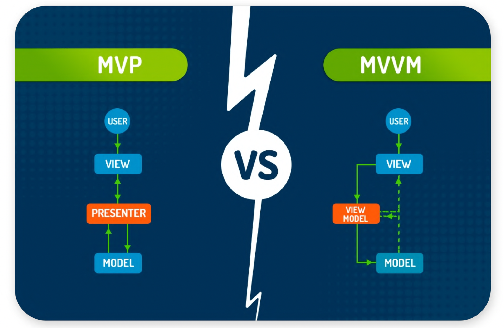
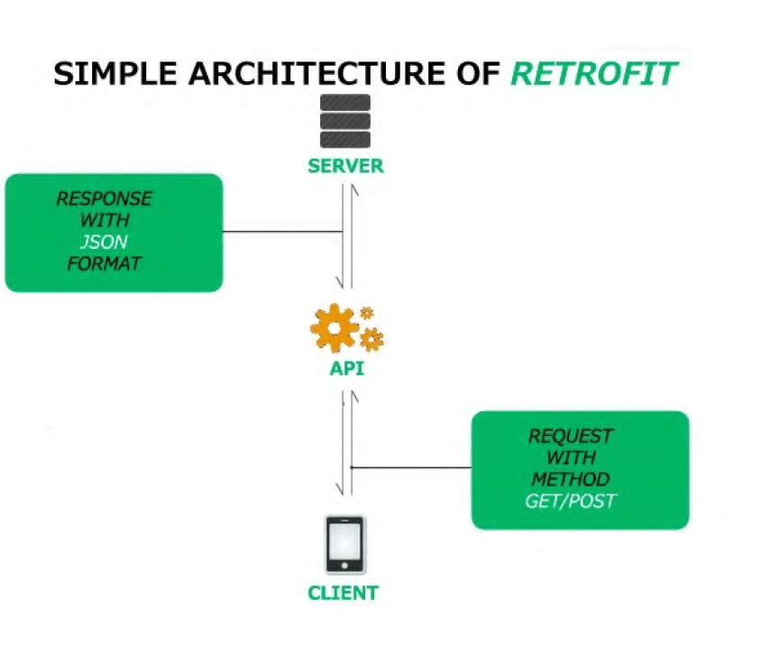
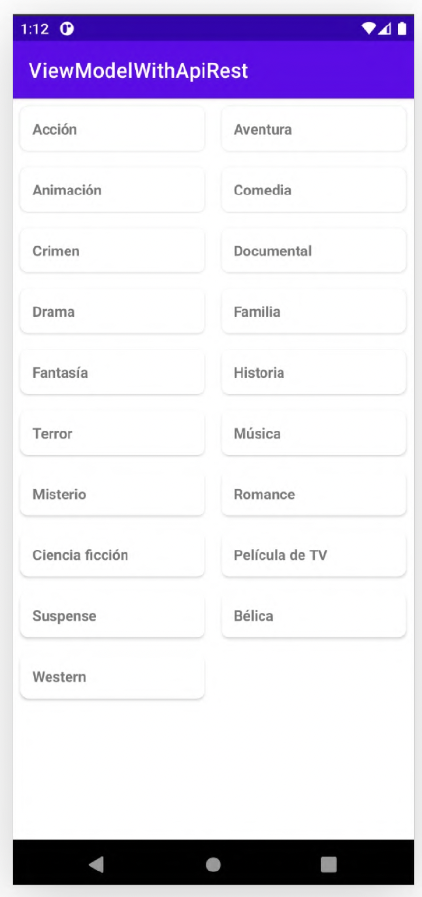

# ViewModel & Retrofit

## Sincronía y Asincronía

## Programación Reactiva

En la programación clásica, todo se basa en acciones que nosotros realizamos activamente. Lo que hacemos
en cada caso es ir y preguntarle «oye, ¿qué datos tienes para mí ahora mismo?

Si quiero algo:

* Yo lo pido
* Yo lo busco
* Yo lo traigo y lo trato
* Yo lo muestro

En la programación reactiva, le damos la vuelta a la idea. La forma de trabajar sería «estoy interesado en tus
datos, cada vez que haya un cambio infórmame».

Si quiero algo:

* Yo lo pido y espero a que me lo traigan
* Alguien se encarga de ir buscarlo
* Alguien se encarga de traelo y tratarlo
* Alguien se encarga de entregarmelo

## ViewModel

El componente ViewModel de Android cumple dos funciones: se encarga de la  preparación y administración de los datos relacionados con la vista y maneja la
comunicación de la vista con el resto de la aplicación.

Desde el punto de vista de arquitectura la clase ViewModel está diseñada  como una plantilla para crear modelos de vista en el patrón MVVM.

**¿Por qué usarlo?**

Porque mejora el testing y la eficiencia de mantenimiento de tus casos de uso al aislar responsabilidades de tus controladores de UI (actividades y
fragmentos).

**¿Cómo funciona en cambios de configuración?**

Asegura el guardado del estado en tu UI (Scope) cuando hay cambios de configuración como una rotación de pantalla. Ya que cuando una actividad es
recreada el framework reconecta automáticamente al ViewModel a la instancia.

**Descripción general de ViewModel**: https://developer.android.com/topic/libraries/architecture/viewmodel

## Arquitectura de una App

La arquitectura te orienta para asignar responsabilidades en tu app, entre las clases.

Una arquitectura de app bien diseñada te ayuda a escalar tu app y a extenderla con funciones adicionales en
el futuro.

También facilita la colaboración.

Los <u>principios de arquitectura</u> más comunes son la separación de problemas y el control de la UI a partir de un modelo.

| Responsabilidades del **fragment/activity**                                                                                       | Responsabilidades del **ViewModel**                                                                                                                                                                                                      |
|-----------------------------------------------------------------------------------------------------------------------------------|------------------------------------------------------------------------------------------------------------------------------------------------------------------------------------------------------------------------------------------|
| Las actividades y los fragmentos son responsables de dibujar vistas y datos en la pantalla y responder a los eventos del usuario. | El ViewModel es responsable de retener y procesar todos los datos necesarios para la IU. Nunca debes acceder a tu jerarquía de vistas (como  un objeto de vinculación de vista) ni retener una referencia a la actividad o al fragmento. |

## LiveData vs StateFlow

Cuando trabajamos con un ViewModel, podemos usar dos tipos de objetos para <u>transmitir los datos a la vista</u>.

### LiveData

* **LiveData** es un componente de Android que permite a los componentes de la IU observar los datos que cambian. LiveData es un componente de ciclo de vida, lo que significa que se actualiza solo cuando la app está en primer plano.
* que está integrado en Android y eso ayuda a evitar Leaks de memoria
* está programado con los ciclos de vida de las Activity/Fragment
* y maneja las rotaciones de pantalla para no tener que recargar toda la app

### StateFlow

* **StateFlow** es un flujo de estado que emite valores de forma segura y permite a los suscriptores observar los cambios de estado. StateFlow es un componente de flujo, lo que significa que se actualiza en cualquier momento, incluso cuando la app está en segundo plano.
* que está integrado en Kotlin y permite emitir multiples valores secuencialmente
* es independiente del ciclo de vida de cada Activity/Fragment (en lo bueno y lo malo)

De un vistazo, en realidad son muy similares y puedes hacer prácticamente LO MISMO.

Sin embargo, bajo el capó, los Flow son una API más rica y flexible que amplía las capacidades de LiveData, sin algunos de los inconvenientes.

## Retrofit

Para hacer peticiones a una API, podemos usar la Librería de Retrofit que nos ayuda a trabajar con peticiones de manera sencilla y rápida.

Una API es un conjunto de reglas que permite que diferentes programas se comuniquen entre sí. Utilizaremos JSON como "lenguaje" de comunicación entre servidores y la app.

Retrofit es un cliente de servidores REST para Android y Java desarrollado por Square, muy simple y muy fácil  de aprender. 
Permite hacer peticiones al servidor tipo: GET, POST, PUT, PATCH, DELETE y HEAD, y gestionar diferentes tipos de parámetros, 
parseando automáticamente la respuesta a un tipo de datos.

# Práctica

Vamos a utilizar la API de TheMovieDB para obtener géneros de películas en una app. El resultado de la app
será el siguiente.

