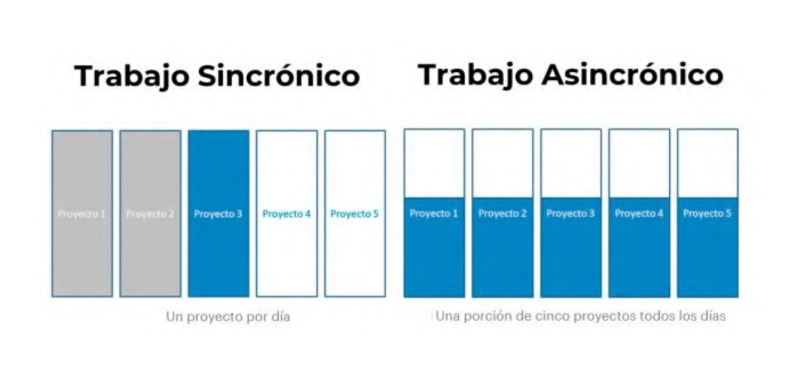
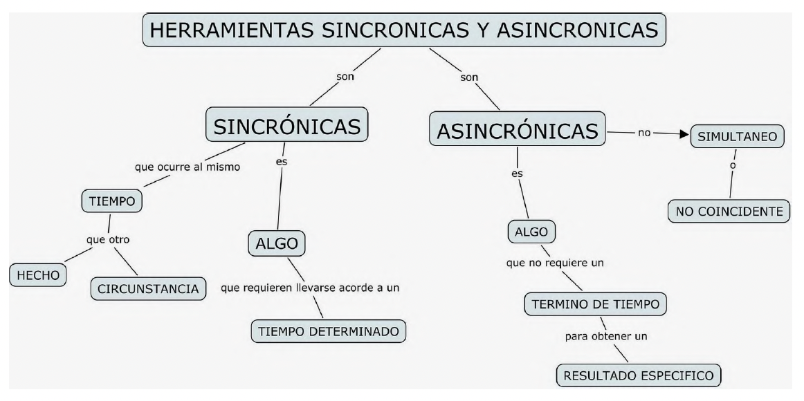
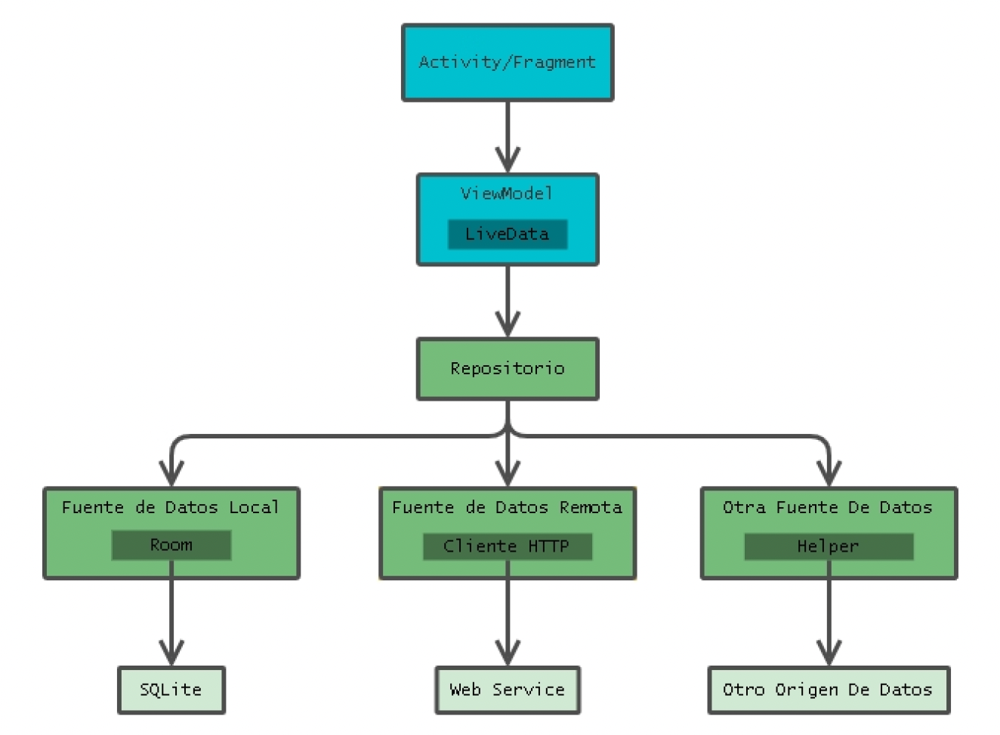
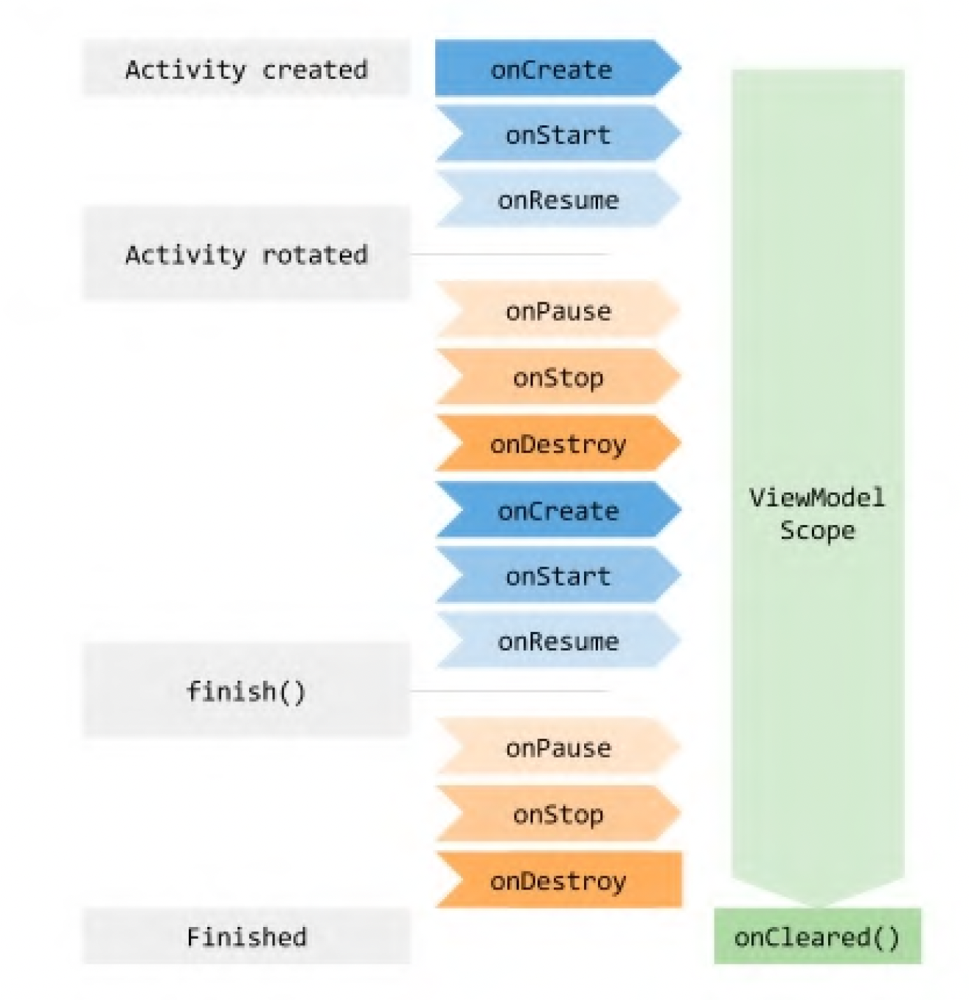

# ViewModel & Retrofit

## Sincronía y Asincronía

## Programación Reactiva

En la programación clásica, todo se basa en acciones que nosotros realizamos activamente. Lo que hacemos
en cada caso es ir y preguntarle «oye, ¿qué datos tienes para mí ahora mismo?

Si quiero algo:

* Yo lo pido
* Yo lo busco
* Yo lo traigo y lo trato
* Yo lo muestro

En la programación reactiva, le damos la vuelta a la idea. La forma de trabajar sería «estoy interesado en tus
datos, cada vez que haya un cambio infórmame».

Si quiero algo:

* Yo lo pido y espero a que me lo traigan
* Alguien se encarga de ir buscarlo
* Alguien se encarga de traelo y tratarlo
* Alguien se encarga de entregarmelo

## ViewModel

El componente ViewModel de Android cumple dos funciones: se encarga de la  preparación y administración de los datos relacionados con la vista y maneja la
comunicación de la vista con el resto de la aplicación.

Desde el punto de vista de arquitectura la clase ViewModel está diseñada  como una plantilla para crear modelos de vista en el patrón MVVM.

**¿Por qué usarlo?**

Porque mejora el testing y la eficiencia de mantenimiento de tus casos de uso al aislar responsabilidades de tus controladores de UI (actividades y
fragmentos).

**¿Cómo funciona en cambios de configuración?

Asegura el guardado del estado en tu UI (Scope) cuando hay cambios de configuración como una rotación de pantalla. Ya que cuando una actividad es
recreada el framework reconecta automáticamente al ViewModel a la instancia.

**Descripción general de ViewModel**: https://developer.android.com/topic/libraries/architecture/viewmodel

## Arquitectura de una App

La arquitectura te orienta para asignar responsabilidades en tu app, entre las clases.

Una arquitectura de app bien diseñada te ayuda a escalar tu app y a extenderla con funciones adicionales en
el futuro.

También facilita la colaboración.

Los principios arquitectura más comunes son la separación de problemas y el control de la UI a partir de un
modelo.

| Responsabilidades del **fragment/activity**                                                                                       | Responsabilidades del **ViewModel**                                                                                                                                                                                                      |
|-----------------------------------------------------------------------------------------------------------------------------------|------------------------------------------------------------------------------------------------------------------------------------------------------------------------------------------------------------------------------------------|
| Las actividades y los fragmentos son responsables de dibujar vistas y datos en la pantalla y responder a los eventos del usuario. | El ViewModel es responsable de retener y procesar todos los datos necesarios para la IU. Nunca debes acceder a tu jerarquía de vistas (como  un objeto de vinculación de vista) ni retener una referencia a la actividad o al fragmento. |

# android-viewmodel-retrofit
